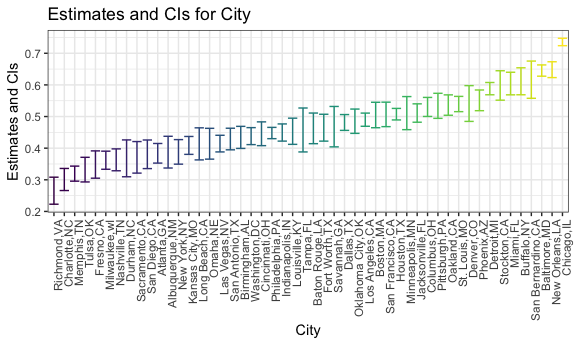

p8105\_hw5\_xy2397
================
Xue Yang
11/2/2018

Problem 1
---------

Create a tidy dataframe containing data from all participants, including the subject ID, arm, and observations over time:

• Start with a dataframe containing all file names; the list.files function will help

• Iterate over file names and read in data for each subject using purrr::map and saving the result as a new variable in the dataframe

• Tidy the result; manipulate file names to include control arm and subject ID, make sure weekly observations are “tidy”, and do any other tidying that’s necessary

Make a spaghetti plot showing observations on each subject over time, and comment on differences between groups.

``` r
study = 
  tibble(file_name = list.files(path = "./data/pro1")) %>% 
  mutate(output = purrr::map(str_c("./data/pro1/", file_name), read_csv)) %>%
  unnest() %>% 
  mutate(file_name = str_replace(file_name, ".csv", "")) %>% 
  separate(file_name, into = c("arm", "id"), sep = "_") %>% 
  mutate(arm = str_replace(arm, "con", "control"),
         arm = str_replace(arm, "exp", "experimental")) %>% 
  gather(key = "week", value = "data", week_1:week_8) %>% 
  mutate(week = str_replace(week, "week_", ""))
```

    ## Parsed with column specification:
    ## cols(
    ##   week_1 = col_double(),
    ##   week_2 = col_double(),
    ##   week_3 = col_double(),
    ##   week_4 = col_double(),
    ##   week_5 = col_double(),
    ##   week_6 = col_double(),
    ##   week_7 = col_double(),
    ##   week_8 = col_double()
    ## )
    ## Parsed with column specification:
    ## cols(
    ##   week_1 = col_double(),
    ##   week_2 = col_double(),
    ##   week_3 = col_double(),
    ##   week_4 = col_double(),
    ##   week_5 = col_double(),
    ##   week_6 = col_double(),
    ##   week_7 = col_double(),
    ##   week_8 = col_double()
    ## )
    ## Parsed with column specification:
    ## cols(
    ##   week_1 = col_double(),
    ##   week_2 = col_double(),
    ##   week_3 = col_double(),
    ##   week_4 = col_double(),
    ##   week_5 = col_double(),
    ##   week_6 = col_double(),
    ##   week_7 = col_double(),
    ##   week_8 = col_double()
    ## )
    ## Parsed with column specification:
    ## cols(
    ##   week_1 = col_double(),
    ##   week_2 = col_double(),
    ##   week_3 = col_double(),
    ##   week_4 = col_double(),
    ##   week_5 = col_double(),
    ##   week_6 = col_double(),
    ##   week_7 = col_double(),
    ##   week_8 = col_double()
    ## )
    ## Parsed with column specification:
    ## cols(
    ##   week_1 = col_double(),
    ##   week_2 = col_double(),
    ##   week_3 = col_double(),
    ##   week_4 = col_double(),
    ##   week_5 = col_double(),
    ##   week_6 = col_double(),
    ##   week_7 = col_double(),
    ##   week_8 = col_double()
    ## )
    ## Parsed with column specification:
    ## cols(
    ##   week_1 = col_double(),
    ##   week_2 = col_double(),
    ##   week_3 = col_double(),
    ##   week_4 = col_double(),
    ##   week_5 = col_double(),
    ##   week_6 = col_double(),
    ##   week_7 = col_double(),
    ##   week_8 = col_double()
    ## )
    ## Parsed with column specification:
    ## cols(
    ##   week_1 = col_double(),
    ##   week_2 = col_double(),
    ##   week_3 = col_double(),
    ##   week_4 = col_double(),
    ##   week_5 = col_double(),
    ##   week_6 = col_double(),
    ##   week_7 = col_double(),
    ##   week_8 = col_double()
    ## )
    ## Parsed with column specification:
    ## cols(
    ##   week_1 = col_double(),
    ##   week_2 = col_double(),
    ##   week_3 = col_double(),
    ##   week_4 = col_double(),
    ##   week_5 = col_double(),
    ##   week_6 = col_double(),
    ##   week_7 = col_double(),
    ##   week_8 = col_double()
    ## )
    ## Parsed with column specification:
    ## cols(
    ##   week_1 = col_double(),
    ##   week_2 = col_double(),
    ##   week_3 = col_double(),
    ##   week_4 = col_double(),
    ##   week_5 = col_double(),
    ##   week_6 = col_double(),
    ##   week_7 = col_double(),
    ##   week_8 = col_double()
    ## )
    ## Parsed with column specification:
    ## cols(
    ##   week_1 = col_double(),
    ##   week_2 = col_double(),
    ##   week_3 = col_double(),
    ##   week_4 = col_double(),
    ##   week_5 = col_double(),
    ##   week_6 = col_double(),
    ##   week_7 = col_double(),
    ##   week_8 = col_double()
    ## )
    ## Parsed with column specification:
    ## cols(
    ##   week_1 = col_double(),
    ##   week_2 = col_double(),
    ##   week_3 = col_double(),
    ##   week_4 = col_double(),
    ##   week_5 = col_double(),
    ##   week_6 = col_double(),
    ##   week_7 = col_double(),
    ##   week_8 = col_double()
    ## )
    ## Parsed with column specification:
    ## cols(
    ##   week_1 = col_double(),
    ##   week_2 = col_double(),
    ##   week_3 = col_double(),
    ##   week_4 = col_double(),
    ##   week_5 = col_double(),
    ##   week_6 = col_double(),
    ##   week_7 = col_double(),
    ##   week_8 = col_double()
    ## )
    ## Parsed with column specification:
    ## cols(
    ##   week_1 = col_double(),
    ##   week_2 = col_double(),
    ##   week_3 = col_double(),
    ##   week_4 = col_double(),
    ##   week_5 = col_double(),
    ##   week_6 = col_double(),
    ##   week_7 = col_double(),
    ##   week_8 = col_double()
    ## )

    ## Parsed with column specification:
    ## cols(
    ##   week_1 = col_double(),
    ##   week_2 = col_double(),
    ##   week_3 = col_double(),
    ##   week_4 = col_double(),
    ##   week_5 = col_double(),
    ##   week_6 = col_double(),
    ##   week_7 = col_integer(),
    ##   week_8 = col_double()
    ## )

    ## Parsed with column specification:
    ## cols(
    ##   week_1 = col_double(),
    ##   week_2 = col_double(),
    ##   week_3 = col_double(),
    ##   week_4 = col_double(),
    ##   week_5 = col_double(),
    ##   week_6 = col_double(),
    ##   week_7 = col_double(),
    ##   week_8 = col_double()
    ## )
    ## Parsed with column specification:
    ## cols(
    ##   week_1 = col_double(),
    ##   week_2 = col_double(),
    ##   week_3 = col_double(),
    ##   week_4 = col_double(),
    ##   week_5 = col_double(),
    ##   week_6 = col_double(),
    ##   week_7 = col_double(),
    ##   week_8 = col_double()
    ## )
    ## Parsed with column specification:
    ## cols(
    ##   week_1 = col_double(),
    ##   week_2 = col_double(),
    ##   week_3 = col_double(),
    ##   week_4 = col_double(),
    ##   week_5 = col_double(),
    ##   week_6 = col_double(),
    ##   week_7 = col_double(),
    ##   week_8 = col_double()
    ## )
    ## Parsed with column specification:
    ## cols(
    ##   week_1 = col_double(),
    ##   week_2 = col_double(),
    ##   week_3 = col_double(),
    ##   week_4 = col_double(),
    ##   week_5 = col_double(),
    ##   week_6 = col_double(),
    ##   week_7 = col_double(),
    ##   week_8 = col_double()
    ## )
    ## Parsed with column specification:
    ## cols(
    ##   week_1 = col_double(),
    ##   week_2 = col_double(),
    ##   week_3 = col_double(),
    ##   week_4 = col_double(),
    ##   week_5 = col_double(),
    ##   week_6 = col_double(),
    ##   week_7 = col_double(),
    ##   week_8 = col_double()
    ## )
    ## Parsed with column specification:
    ## cols(
    ##   week_1 = col_double(),
    ##   week_2 = col_double(),
    ##   week_3 = col_double(),
    ##   week_4 = col_double(),
    ##   week_5 = col_double(),
    ##   week_6 = col_double(),
    ##   week_7 = col_double(),
    ##   week_8 = col_double()
    ## )

``` r
study %>% 
  ggplot(aes(x = week, y = data)) +
  geom_point(aes(color = id)) +
  geom_line(aes(group = id, color = id)) +
  facet_grid(~arm) +
  labs(
    title = "Spaghetti plot",
    x = "Week",
    y = "Data"
  ) + 
  viridis::scale_color_viridis(
    name = "Subject ID",
    discrete = TRUE
    ) 
```


Problem 2
---------

``` r
homicide = 
  read_csv(file = "./data/pro2/homicide-data.csv") %>% 
  unite(city_state, city, state, sep = ",")
```

    ## Parsed with column specification:
    ## cols(
    ##   uid = col_character(),
    ##   reported_date = col_integer(),
    ##   victim_last = col_character(),
    ##   victim_first = col_character(),
    ##   victim_race = col_character(),
    ##   victim_age = col_character(),
    ##   victim_sex = col_character(),
    ##   city = col_character(),
    ##   state = col_character(),
    ##   lat = col_double(),
    ##   lon = col_double(),
    ##   disposition = col_character()
    ## )

Describe the raw data. Create a city\_state variable (e.g. “Baltimore, MD”) and then summarize within cities to obtain the total number of homicides and the number of unsolved homicides (those for which the disposition is “Closed without arrest” or “Open/No arrest”).

The data is 52179 rows x 11 columns.

``` r
total = 
  homicide %>% 
  group_by(city_state) %>% 
  summarize(number = n()) %>% 
  unnest()

unsolved = 
  homicide %>%   
  filter(disposition %in% c("Closed without arrest", "Open/No arrest")) %>%
  group_by(city_state) %>% 
  summarize(number_unsolved = n()) %>% 
  unnest() 
```

For the city of Baltimore, MD, use the prop.test function to estimate the proportion of homicides that are unsolved; save the output of prop.test as an R object, apply the broom::tidy to this object and pull the estimated proportion and confidence intervals from the resulting tidy dataframe.

``` r
# should be wriiten as a function
n =
  total %>% 
  filter(city_state == "Baltimore,MD") %>% 
  pull(number)

x =
  unsolved %>% 
  filter(city_state == "Baltimore,MD") %>% 
  pull(number_unsolved)

result = 
  prop.test(x, n, alternative = "two.sided") %>% 
  broom::tidy() 

results = 
  tibble(
    
  estimated_proportion = 
    result %>% 
    pull(estimate),
  
  conf_low = 
    result %>% 
    pull(conf.low),
  
  conf_high = 
    result %>% 
    pull(conf.high)
  )
```

Now run prop.test for each of the cities in your dataset, and extract both the proportion of unsolved homicides and the confidence interval for each. Do this within a “tidy” pipeline, making use of purrr::map, purrr::map2, list columns and unnest as necessary to create a tidy dataframe with estimated proportions and CIs for each city.

``` r
# "Tulsa,AL" don't have unsolved homicides
proportion_test = function(city){
  n =
  total %>% 
  filter(city_state == city) %>% 
  pull(number)
  
  x =
  unsolved %>% 
  filter(city_state == city) %>% 
  pull(number_unsolved)
  
  result = prop.test(x, n, alternative = "two.sided")
  
  broom::tidy(result) 
  
}
```

output = purrr::map(.x = unsolved*c**i**t**y*<sub>*s*</sub>*t**a**t**e*,  *p**r**o**p**o**r**t**i**o**n*<sub>*t*</sub>*e**s**t*(*c**i**t**y* = .*x*))city\_state) %&gt;% select(city\_state, estimated\_proportion = estimate, conf.low, conf.high) %&gt;% unite(CIs, conf.low, conf.high, sep = ",")

``` r
output = 
  tibble(city = unsolved$city_state) %>% 
  mutate(estimate = purrr::map(.x = unsolved$city_state, ~proportion_test(city = .x))) %>%
  unnest() %>% 
  select(city,
         estimated_proportion = estimate,
         conf.low, 
         conf.high) 
 # unite(CIs, conf.low, conf.high, sep = ",")
```

Create a plot that shows the estimates and CIs for each city – check out geom\_errorbar for a way to add error bars based on the upper and lower limits. Organize cities according to the proportion of unsolved homicides.

``` r
output %>% 
  mutate(city = forcats::fct_reorder(city, estimated_proportion)) %>% 
  ggplot(aes(x = city, y = estimated_proportion, color = city)) +
  geom_errorbar(aes(ymin = conf.low, ymax = conf.high)) +
  labs(
    title = "Estimates and CIs for City",
    x = "City",
    y = "Estimates and CIs"
  ) +
  viridis::scale_color_viridis(
    name = "City",
    discrete = TRUE
  ) +
  theme(legend.position = "none") +
  theme(axis.text.x = element_text(angle = 90, hjust = 1)) 
```


