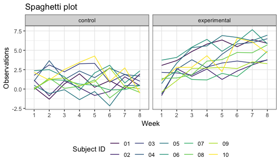

p8105\_hw5\_xy2397
================
Xue Yang
11/2/2018

Problem 1
---------

Create a tidy dataframe containing data from all participants, including the subject ID, arm, and observations over time:

• Start with a dataframe containing all file names; the list.files function will help

• Iterate over file names and read in data for each subject using purrr::map and saving the result as a new variable in the dataframe

• Tidy the result; manipulate file names to include control arm and subject ID, make sure weekly observations are “tidy”, and do any other tidying that’s necessary

Make a spaghetti plot showing observations on each subject over time, and comment on differences between groups.

``` r
study = 
  
  # start with a dataframe containing all file names
  tibble(file_name = list.files(path = "./data/pro1")) %>% 
  
  # iterate over file names and read in data for each subject
  mutate(output = purrr::map(str_c("./data/pro1/", file_name), read_csv)) %>%
  
  # unnest the dataframe
  unnest() %>% 
  
  # separate the file name with arm and subject id
  mutate(file_name = str_replace(file_name, ".csv", "")) %>% 
  separate(file_name, into = c("arm", "subject_id"), sep = "_") %>% 
  mutate(arm = str_replace(arm, "con", "control"),
         arm = str_replace(arm, "exp", "experimental")) %>% 
  
  # gather the week and observations
  gather(key = "week", value = "observation", week_1:week_8) %>% 
  mutate(week = str_replace(week, "week_", "")) %>% 
  arrange(subject_id)
```

``` r
study %>% 
  ggplot(aes(x = week, y = observation)) +
  #geom_point(aes(color = subject_id)) +
  geom_line(aes(group = subject_id, color = subject_id)) +
  facet_grid(~arm) +
  labs(
    title = "Spaghetti plot",
    x = "Week",
    y = "Observations"
  ) + 
  viridis::scale_color_viridis(
    name = "Subject ID",
    discrete = TRUE
    ) 
```



By looking at the observations from spaghetti plot between control arm and experimental arm, we can find that there are increase trend on each subject over time in the observations form experimental arm but there aren't increase trend in control arm.

Problem 2
---------

``` r
homicide = 
  read_csv(file = "./data/pro2/homicide-data.csv") 
```

Describe the raw data

The data is 52179 rows x 12 columns, which means that there are 52179 observations of criminal homicides in 50 of the largest American cities. We are major interested in the variables like the location of criminal homicides (city and state) and disposition of the homicides (solved or unsolved).

Create a city\_state variable (e.g. “Baltimore, MD”)

``` r
homicide = 
  homicide %>% 
  # create a city_state variabl
  unite(city_state, city, state, sep = ",") 
```

Summarize within cities to obtain the total number of homicides and the number of unsolved homicides (those for which the disposition is “Closed without arrest” or “Open/No arrest”).

``` r
total = 
  homicide %>% 
  group_by(city_state) %>% 
  summarize(number = n()) %>% 
  unnest()

unsolved = 
  homicide %>%   
  filter(disposition %in% c("Closed without arrest", "Open/No arrest")) %>%
  group_by(city_state) %>% 
  summarize(number_unsolved = n()) %>% 
  unnest() 
```

The following tables are the total number of homicides and the number of unsolved homicides within each city.

``` r
total %>% 
  knitr::kable(digits = 3)
```

| city\_state       |  number|
|:------------------|-------:|
| Albuquerque,NM    |     378|
| Atlanta,GA        |     973|
| Baltimore,MD      |    2827|
| Baton Rouge,LA    |     424|
| Birmingham,AL     |     800|
| Boston,MA         |     614|
| Buffalo,NY        |     521|
| Charlotte,NC      |     687|
| Chicago,IL        |    5535|
| Cincinnati,OH     |     694|
| Columbus,OH       |    1084|
| Dallas,TX         |    1567|
| Denver,CO         |     312|
| Detroit,MI        |    2519|
| Durham,NC         |     276|
| Fort Worth,TX     |     549|
| Fresno,CA         |     487|
| Houston,TX        |    2942|
| Indianapolis,IN   |    1322|
| Jacksonville,FL   |    1168|
| Kansas City,MO    |    1190|
| Las Vegas,NV      |    1381|
| Long Beach,CA     |     378|
| Los Angeles,CA    |    2257|
| Louisville,KY     |     576|
| Memphis,TN        |    1514|
| Miami,FL          |     744|
| Milwaukee,wI      |    1115|
| Minneapolis,MN    |     366|
| Nashville,TN      |     767|
| New Orleans,LA    |    1434|
| New York,NY       |     627|
| Oakland,CA        |     947|
| Oklahoma City,OK  |     672|
| Omaha,NE          |     409|
| Philadelphia,PA   |    3037|
| Phoenix,AZ        |     914|
| Pittsburgh,PA     |     631|
| Richmond,VA       |     429|
| Sacramento,CA     |     376|
| San Antonio,TX    |     833|
| San Bernardino,CA |     275|
| San Diego,CA      |     461|
| San Francisco,CA  |     663|
| Savannah,GA       |     246|
| St. Louis,MO      |    1677|
| Stockton,CA       |     444|
| Tampa,FL          |     208|
| Tulsa,AL          |       1|
| Tulsa,OK          |     583|
| Washington,DC     |    1345|

``` r
unsolved %>% 
  knitr::kable(digits = 3)
```

| city\_state       |  number\_unsolved|
|:------------------|-----------------:|
| Albuquerque,NM    |               146|
| Atlanta,GA        |               373|
| Baltimore,MD      |              1825|
| Baton Rouge,LA    |               196|
| Birmingham,AL     |               347|
| Boston,MA         |               310|
| Buffalo,NY        |               319|
| Charlotte,NC      |               206|
| Chicago,IL        |              4073|
| Cincinnati,OH     |               309|
| Columbus,OH       |               575|
| Dallas,TX         |               754|
| Denver,CO         |               169|
| Detroit,MI        |              1482|
| Durham,NC         |               101|
| Fort Worth,TX     |               255|
| Fresno,CA         |               169|
| Houston,TX        |              1493|
| Indianapolis,IN   |               594|
| Jacksonville,FL   |               597|
| Kansas City,MO    |               486|
| Las Vegas,NV      |               572|
| Long Beach,CA     |               156|
| Los Angeles,CA    |              1106|
| Louisville,KY     |               261|
| Memphis,TN        |               483|
| Miami,FL          |               450|
| Milwaukee,wI      |               403|
| Minneapolis,MN    |               187|
| Nashville,TN      |               278|
| New Orleans,LA    |               930|
| New York,NY       |               243|
| Oakland,CA        |               508|
| Oklahoma City,OK  |               326|
| Omaha,NE          |               169|
| Philadelphia,PA   |              1360|
| Phoenix,AZ        |               504|
| Pittsburgh,PA     |               337|
| Richmond,VA       |               113|
| Sacramento,CA     |               139|
| San Antonio,TX    |               357|
| San Bernardino,CA |               170|
| San Diego,CA      |               175|
| San Francisco,CA  |               336|
| Savannah,GA       |               115|
| St. Louis,MO      |               905|
| Stockton,CA       |               266|
| Tampa,FL          |                95|
| Tulsa,OK          |               193|
| Washington,DC     |               589|

Noticing that "Tulsa,AL" doesn't have unsolved homicides.

``` r
homicide %>%   
  filter(city_state == "Tulsa,AL") %>% 
  knitr::kable(digits = 3)
```

| uid        |  reported\_date| victim\_last | victim\_first | victim\_race | victim\_age | victim\_sex | city\_state |     lat|      lon| disposition      |
|:-----------|---------------:|:-------------|:--------------|:-------------|:------------|:------------|:------------|-------:|--------:|:-----------------|
| Tul-000769 |        20160930| HARRIS       | LESLIE        | White        | 41          | Female      | Tulsa,AL    |  36.074|  -95.978| Closed by arrest |

For the city of Baltimore, MD, use the prop.test function to estimate the proportion of homicides that are unsolved; save the output of prop.test as an R object, apply the broom::tidy to this object and pull the estimated proportion and confidence intervals from the resulting tidy dataframe.

``` r
# should be wriiten as a function?
n =
  total %>% 
  filter(city_state == "Baltimore,MD") %>% 
  pull(number)

x =
  unsolved %>% 
  filter(city_state == "Baltimore,MD") %>% 
  pull(number_unsolved)

result = 
  prop.test(x, n, alternative = "two.sided") %>% 
  broom::tidy() 

results = 
  tibble(
    
  estimated_proportion = 
    result %>% 
    pull(estimate),
  
  conf_low = 
    result %>% 
    pull(conf.low),
  
  conf_high = 
    result %>% 
    pull(conf.high)
  )
```

Now run prop.test for each of the cities in your dataset, and extract both the proportion of unsolved homicides and the confidence interval for each. Do this within a “tidy” pipeline, making use of purrr::map, purrr::map2, list columns and unnest as necessary to create a tidy dataframe with estimated proportions and CIs for each city.

``` r
# "Tulsa,AL" don't have unsolved homicides

proportion_test = function(city){
  n =
  total %>% 
  filter(city_state == city) %>% 
  pull(number)
  
  x =
  unsolved %>% 
  filter(city_state == city) %>% 
  pull(number_unsolved)
  
  result = prop.test(x, n, alternative = "two.sided")
  
  broom::tidy(result) 
  
}
```

Note that since the city "Tulsa,AL" don't have unsolved homicides, so when dealing with the proportion of unsolved homicides and the confidence interval for each, we only concentrate on the left 50 cities that contains both solved and unsolved homicides.

``` r
output = 
  tibble(city = unsolved$city_state) %>% 
  mutate(estimate = purrr::map(.x = unsolved$city_state, ~proportion_test(city = .x))) %>%
  unnest() %>% 
  select(city,
         estimated_proportion = estimate,
         conf.low, 
         conf.high) 
 # unite(CIs, conf.low, conf.high, sep = ",")
```

Create a plot that shows the estimates and CIs for each city – check out geom\_errorbar for a way to add error bars based on the upper and lower limits. Organize cities according to the proportion of unsolved homicides.

``` r
output %>% 
  # reorder the city as the increase of median of estimated_proportion
  mutate(city = forcats::fct_reorder(city, estimated_proportion)) %>% 
  ggplot(aes(x = city, y = estimated_proportion, color = city)) +
  geom_errorbar(aes(ymin = conf.low, ymax = conf.high)) +
  labs(
    title = "Estimates and CIs for City",
    x = "City",
    y = "Estimates and CIs"
  ) +
  viridis::scale_color_viridis(
    name = "City",
    discrete = TRUE
  ) +
  theme(legend.position = "none") +
  theme(axis.text.x = element_text(angle = 90, hjust = 1)) 
```


